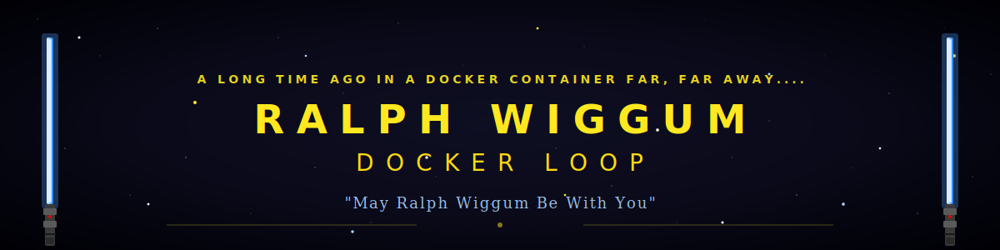
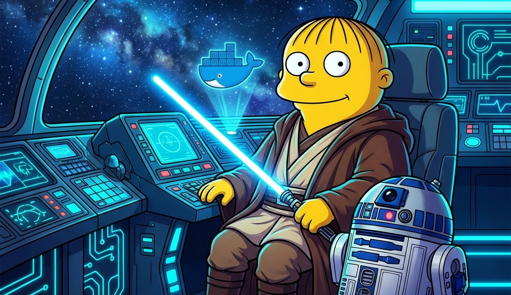
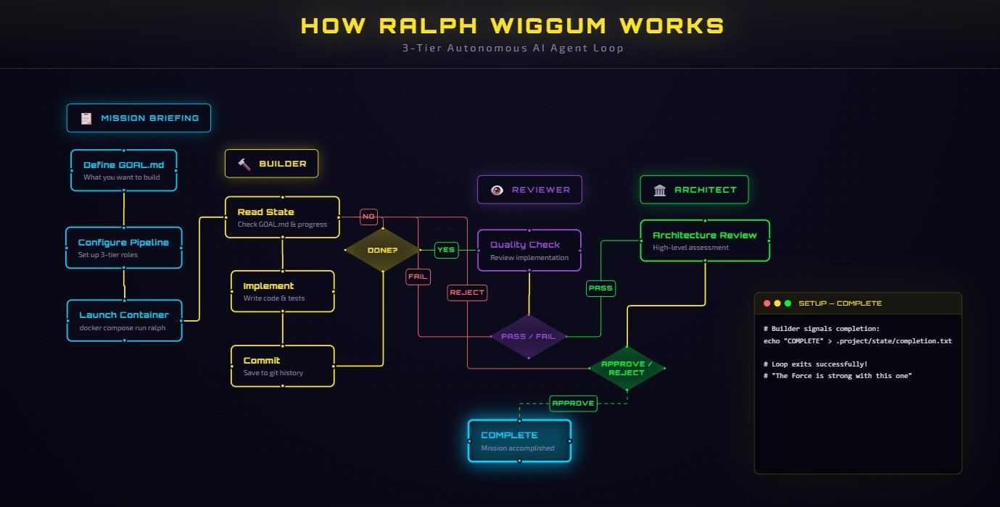
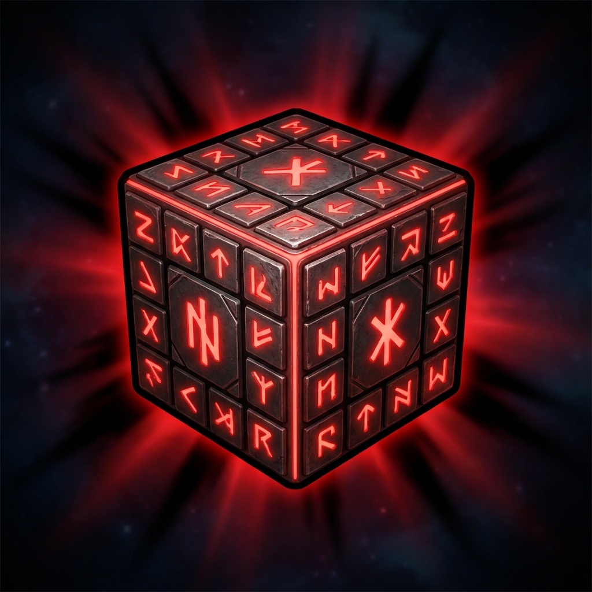
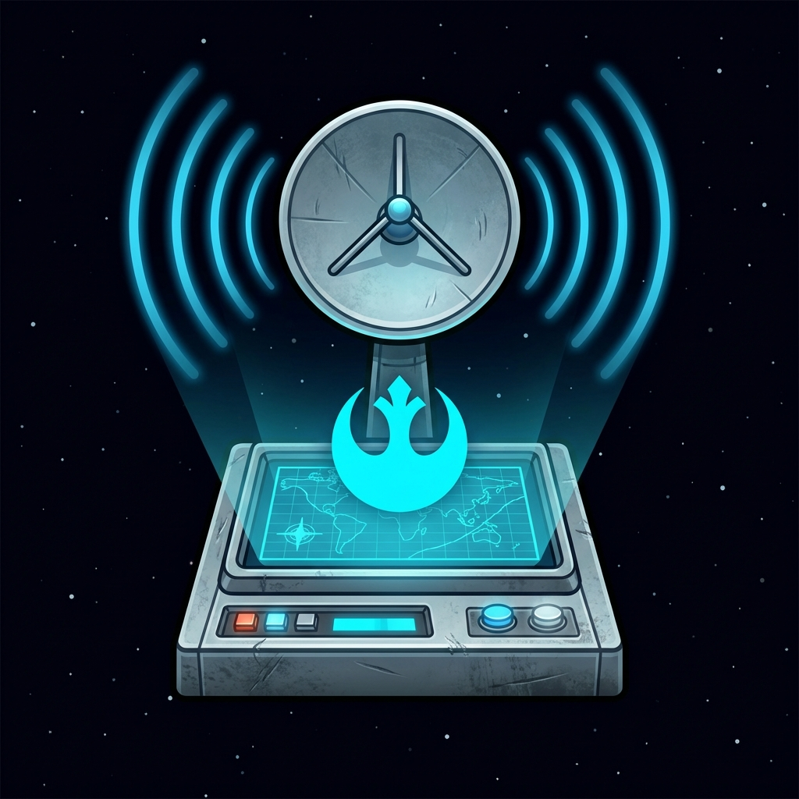
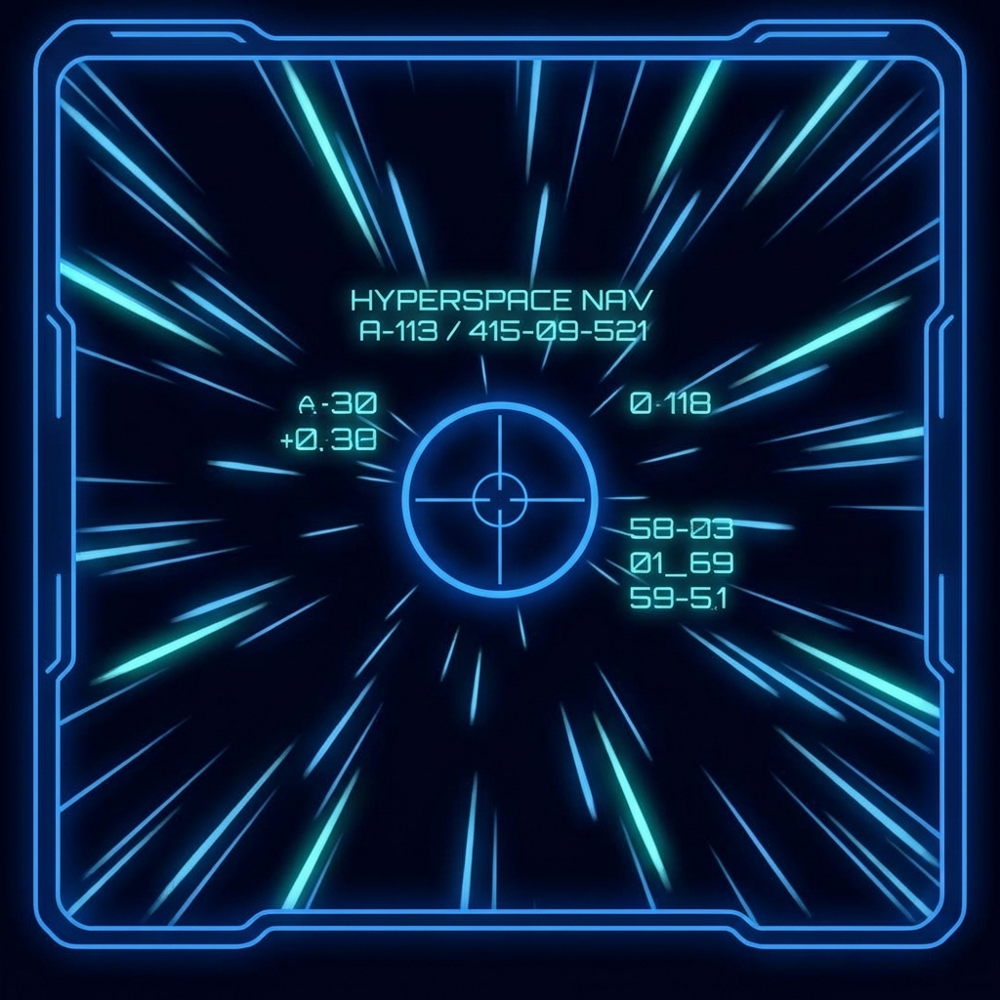
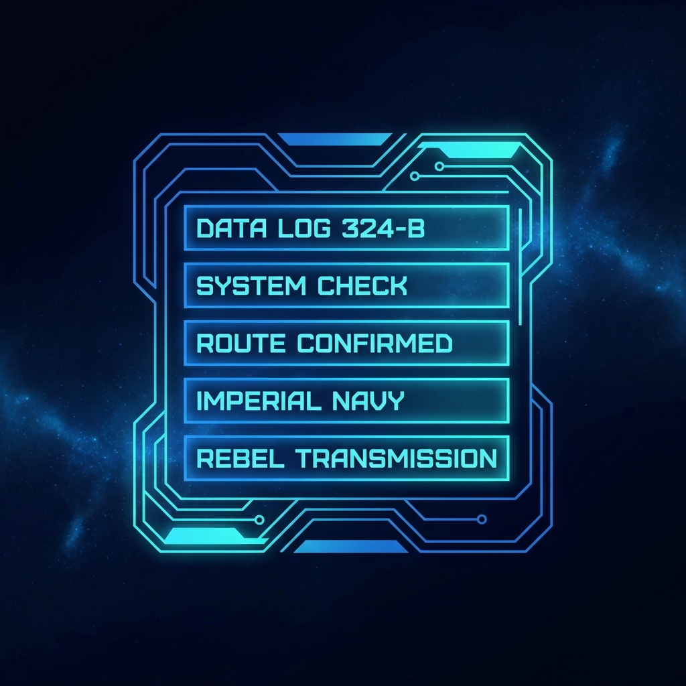
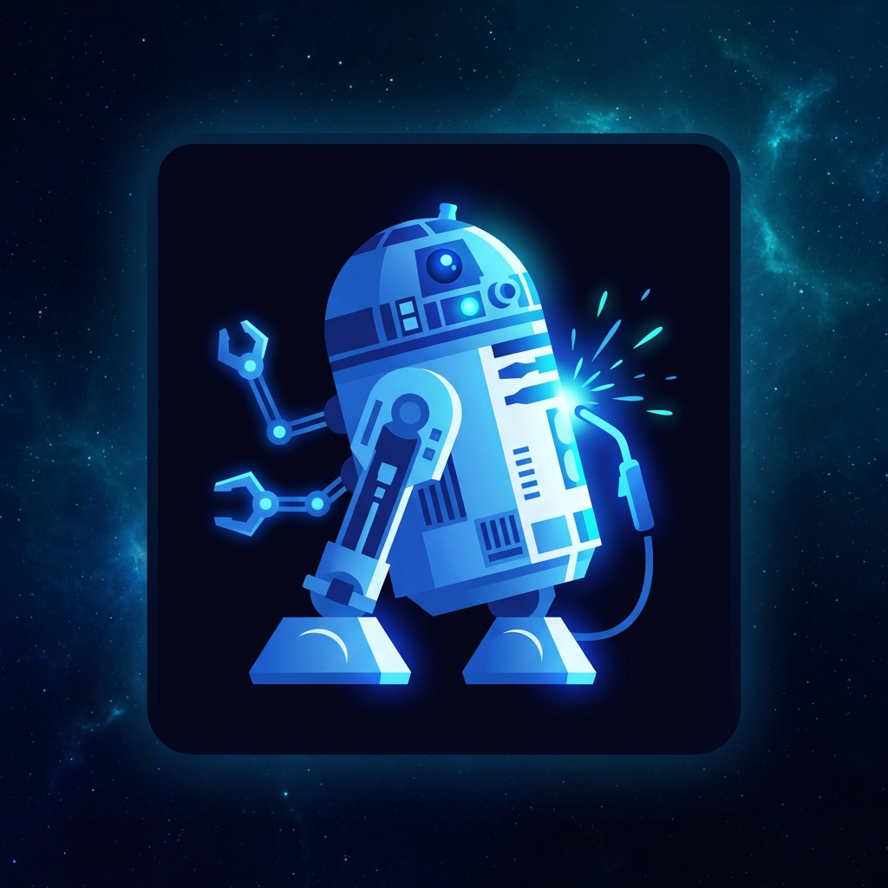

<!--
  ╔═══════════════════════════════════════════════════════════════════════════╗
  ║  RALPH WIGGUM DOCKER LOOP - STAR WARS EDITION                            ║
  ║  "May Ralph Wiggum Be With You"                                          ║
  ╚═══════════════════════════════════════════════════════════════════════════╝
-->

<div align="center">

<!-- Animated Starfield Header -->


<!-- BADGES - Star Wars Styled -->


<!-- Spotify - Star Wars Main Theme -->
[](https://open.spotify.com/track/7a9UUo3zfID7Ik2fTQjRLi)

<!-- Dynamic Typing Effect (via readme-typing-svg service) -->
<picture>
  <source media="(prefers-color-scheme: dark)" srcset="https://readme-typing-svg.demolab.com?font=Orbitron&weight=700&size=16&duration=3000&pause=1000&color=FFE81F&background=0A0A1A00&center=true&vCenter=true&multiline=true&repeat=true&width=600&height=60&lines=A+long+time+ago+in+a+Docker+container+far%2C+far+away....;The+RALPH+WIGGUM+technique+awakens..." />
  <source media="(prefers-color-scheme: light)" srcset="https://readme-typing-svg.demolab.com?font=Orbitron&weight=700&size=16&duration=3000&pause=1000&color=000000&background=FFFFFF00&center=true&vCenter=true&multiline=true&repeat=true&width=600&height=60&lines=A+long+time+ago+in+a+Docker+container+far%2C+far+away....;The+RALPH+WIGGUM+technique+awakens..." />
  
</picture>

<!-- Light/Dark Mode Hero Images -->
<picture>
  <source media="(prefers-color-scheme: dark)" srcset="static/hero-sith.png" />
  <source media="(prefers-color-scheme: light)" srcset="static/hero-jedi.png" />
  
</picture>

<picture>
  <source media="(prefers-color-scheme: dark)" srcset="static/quote-sith.svg" />
  <source media="(prefers-color-scheme: light)" srcset="static/quote-jedi.svg" />
  
</picture>

---
### Start a task, go to bed, wake up to completed work.

</div>

---

## What Is This?

The **Ralph Wiggum technique** (by Geoffrey Huntley) feeds the same prompt to Claude repeatedly:

```bash
while :; do
  cat PROMPT.md | claude-code --continue
done
```

Claude sees its previous work in files and git history, enabling **self-referential improvement** across iterations. Like the Force flowing through a Jedi, each iteration builds upon the last.

I built this to **run safely while I sleep**. Docker provides complete isolation — your AI agents can't escape their containers to wreak havoc on your host system. *"The dark side of the Force is a pathway to many abilities some consider to be... unnatural."*

---

## Quick Start

```bash
# 1. Steal the Death Star plans
git clone https://github.com/jodagreyhame/ralph-wiggum-docker.git
cd ralph-wiggum-docker

# 2. Copy the sacred Holocron
cp env.template .env

# 3. Construct your Star Destroyer
docker compose build

# 4. Assemble the Jedi Council (build CLI)
bun install && bun run build

# 4b. Link globally to use 'ralph' from anywhere (optional but recommended)
bun link

# 5. Begin your first mission
ralph new my-project --preset=three-tier

# 6. Punch it, Chewie!
ralph run my-project  # Works on Windows (PowerShell) and Unix (Bash)
```

---

## The Opening Crawl

<div align="center">

</div>

---

## The Galactic Arsenal

| Power | Jedi Translation |
|-------|------------------|
| **Containment Fields** | Each project imprisoned in its own Docker cell — no escape to your host system |
| **Parallel Universes** | Run multiple missions simultaneously across the galaxy |
| **Multi-Backend Force** | Claude, Gemini, Codex, OpenCode — all paths lead to completion |
| **3-Tier Jedi Council** | Builder does work, Reviewer judges, Architect approves (or rejects you to the outer rim) |
| **Role Escalation** | Padawan fails 3 times? Promote to Knight. Knight fails? Promote to Master. |
| **Provider Fallback** | GLM rate-limited? Switch to Claude. Claude down? Gemini awaits. The mission continues. |
| **Ship's Log** | Every iteration recorded in `logs/iteration_XXX/` — the archives are complete |

---

## System Architecture

<div align="center">
<a href="https://jodagreyhame.github.io/ralph-wiggum-docker/" target="_blank" title="Click for interactive flowchart">

</a>

[](https://jodagreyhame.github.io/ralph-wiggum-docker/)
</div>

---

##  Installation

<details>
<summary><b>Access the Jedi Archives</b></summary>

### Prerequisites

- **Docker** — Your starship's engine
- **Python 3.8+** — For the configuration holocron
- **Git** — The Force that binds the galaxy together

### Environment Setup

```bash
# Copy the sacred template
cp env.template .env

# Edit with your credentials (choose your allegiance)
# GLM (default): No setup needed - "This is the way"
# Anthropic: Add ANTHROPIC_API_KEY
# Gemini: Add GEMINI_API_KEY
```

### Building the Fleet

```bash
# Build all containers
docker compose build

# Or build a specific starship
docker compose build ralph
```

### Building the Ralph CLI

The Ralph CLI provides project management commands. Build and link it globally:

```bash
# Install dependencies and build
bun install
bun run build

# Link globally (recommended)
bun link

# Now you can use 'ralph' from anywhere
ralph --help
ralph new my-project
ralph run my-project
```

**To unlink:**
```bash
bun unlink ralph
```

**Alternative (without linking):** Run directly with bun during development:
```bash
bun run dev --help
```

### Setting Up Symlinks

Each project creates a symlink `CLAUDE.md -> AGENTS.md` for compatibility:

**Linux/Mac:**
```bash
# Automatic during project creation via CLI
ralph new my-project

# Manual setup (if needed)
cd .projects/my-project
ln -s AGENTS.md CLAUDE.md
```

**Windows (PowerShell as Administrator):**
```powershell
# Automatic during project creation via CLI
ralph new my-project

# Manual setup (if needed)
cd .projects/my-project
New-Item -ItemType SymbolicLink -Path CLAUDE.md -Target AGENTS.md
```

**Windows (without admin - using hard link):**
```powershell
# If you can't use symlinks
cd .projects/my-project
New-Item -ItemType HardLink -Path CLAUDE.md -Target AGENTS.md
```

**Why symlinks?** Claude Code looks for `CLAUDE.md`, but the canonical development rules are in `AGENTS.md`. The symlink ensures both tools work seamlessly.

</details>

---

##  Configuration

<details>
<summary><b>Access the Holocron</b></summary>

### The Sacred Config (`config.json`)

```json
{
  "name": "death-star-plans",
  "description": "Definitely not stolen rebel intelligence",
  "version": "0.1.0",

  "prompts": {
    "dir": ".project/prompts",
    "goal": "GOAL.md",
    "builder": "BUILDER.md",
    "reviewer": "REVIEWER.md",
    "architect": "ARCHITECT.md"
  },

  "builder": {
    "backend": "claude",
    "auth_mode": "glm",
    "model": "glm-4.7",
    "session_mode": "fresh"
  },

  "reviewer": {
    "enabled": true,
    "backend": "claude",
    "auth_mode": "anthropic-oauth",
    "model": "opus",
    "session_mode": "fresh"
  },

  "architect": {
    "enabled": true,
    "backend": "opencode",
    "auth_mode": "opencode-oauth",
    "model": "google/antigravity-gemini-3-pro",
    "session_mode": "resume"
  },

  "escalation": {
    "enabled": true,
    "max_builder_failures": 3
  },

  "provider_fallback": {
    "enabled": true,
    "failure_threshold": 10,
    "sequence": [
      {"name": "glm", "backend": "claude", "auth_mode": "glm", "model": "glm-4.7"},
      {"name": "claude", "backend": "claude", "auth_mode": "anthropic-oauth", "model": "opus"},
      {"name": "gemini", "backend": "gemini", "auth_mode": "gemini-oauth", "model": "gemini-2.5-pro"},
      {"name": "codex", "backend": "codex", "auth_mode": "openai-oauth"},
      {"name": "opencode", "backend": "opencode", "auth_mode": "opencode-oauth", "model": "google/antigravity-claude-opus-4-5-thinking"}
    ]
  },

  "task_mode": {
    "enabled": false,
    "specs_dir": ".project/specs/tasks",
    "steering_file": ".project/steering.md"
  },

  "max_iterations": 0,
  "completion_enabled": true,
  "knowledge_dir": ".project"
}
```

### Auth Modes

| Mode | Variable | Description |
|------|----------|-------------|
| `glm` | `RALPH_AUTH_MODE=glm` | Z.ai proxy (default, no setup required) |
| `anthropic-oauth` | `RALPH_AUTH_MODE=anthropic-oauth` | Host `~/.claude` OAuth credentials |
| `anthropic-api` | `RALPH_AUTH_MODE=anthropic-api` | Direct `ANTHROPIC_API_KEY` |
| `gemini-oauth` | `RALPH_AUTH_MODE=gemini-oauth` | Host `~/.gemini` OAuth credentials |
| `gemini-api` | `RALPH_AUTH_MODE=gemini-api` | Direct `GEMINI_API_KEY` |
| `openai-oauth` | `RALPH_AUTH_MODE=openai-oauth` | Host `~/.codex` OAuth credentials |
| `openai-api` | `RALPH_AUTH_MODE=openai-api` | Direct `OPENAI_API_KEY` |
| `opencode-oauth` | `RALPH_AUTH_MODE=opencode-oauth` | Host OpenCode OAuth credentials |

### Session Modes

| Mode | Behavior | Best For |
|------|----------|----------|
| `fresh` | Starts a new session each iteration — no memory of previous runs | Builder & Reviewer — they only need current iteration context |
| `resume` | Continues the same session across iterations — full conversation history | Architect — needs complete context of all reviews to make informed final decisions |

**Why large-context models for Architect?** Models with large context windows (Gemini 1M, OpenCode) can hold the entire project history — every iteration, every review, every piece of feedback. When the Architect makes the final call, it sees everything. *"The archives are complete."*

</details>

---

##  File-Based Communication

<details>
<summary><b>Open Comms Channel</b></summary>

All decisions use the ancient Jedi communication method — file-based signaling:

| Signal | File | Values | Written By |
|--------|------|--------|------------|
| **Completion** | `.project/state/completion.txt` | `COMPLETE` | Builder |
| **Review** | `.project/review/decision.txt` | `PASS` / `FAIL` | Reviewer |
| **Architect** | `.project/architect/decision.txt` | `APPROVE` / `REJECT` | Architect |
| **Blocked** | `BLOCKED.md` | (any content) | Builder |
| **Provider Override** | `.project/state/provider-override.json` | JSON with `requested_backend` | Reviewer/Architect |
| **Provider Health** | `.project/state/provider-health.json` | Auto-tracked status | System |

On FAIL or REJECT, the completion file is automatically cleared — builder must try again.

### Builder Signals Completion

```bash
# When the Death Star plans are complete:
echo "COMPLETE" > .project/state/completion.txt
```

### Jedi Council Review

```bash
# The Council approves:
echo "PASS" > .project/review/decision.txt

# The Council senses a disturbance:
echo "FAIL" > .project/review/decision.txt
cat > .project/review/feedback.md << 'EOF'
## Disturbance in the Force

- The dark side clouds everything
- Your lack of tests disturbs me
EOF
```

### Galactic Senate Decision

```bash
# The Senate votes:
echo "APPROVE" > .project/architect/decision.txt

# Emergency session called:
echo "REJECT" > .project/architect/decision.txt
```

</details>

---

##  3-Tier Review System

<details>
<summary><b>The Three Tiers of Power</b></summary>

| Role | Default Power | Purpose | Session | Quote |
|------|---------------|---------|---------|-------|
| **Builder** | GLM | Does the work | fresh | *"I'm learnding!"* |
| **Reviewer** | Claude Opus | Pass/fail gate | fresh | *"Do or do not, there is no try."* |
| **Architect** | Gemini (1M ctx) | Final approval | resume | *"The senate will decide your fate."* |

### The Flow of the Force

```
Builder → Reviewer (PASS/FAIL) → Architect (APPROVE/REJECT)
    ↑______________________________________________|
                     (feedback loop)
```

### Escalation Protocol

After 3 consecutive failures, roles promote up the chain. Even a Padawan can become a Master.

```
BEFORE ESCALATION:           AFTER ESCALATION:
  Builder  = GLM               Builder  = Opus (was Reviewer)
  Reviewer = Opus      →       Reviewer = Gemini (was Architect)
  Architect = Gemini           Architect = (none, 2-tier mode)
```

</details>

---

## Status Messages

| Signal | File | Jedi Translation |
|--------|------|------------------|
| ✅ **COMPLETE** | `completion.txt` | *"The Force is strong with this one"* |
| 🚫 **BLOCKED** | `BLOCKED.md` | *"I've got a bad feeling about this"* |
| ⏸️ **CANCELLED** | (Ctrl+C) | *"It's a trap!"* |
| 🔄 **MAX ITERATIONS** | (limit hit) | *"That's no moon..."* |
| ⬆️ **ESCALATION** | (auto) | *"I am your father"* |

---

##  Environment Variables

<details>
<summary><b>Hyperspace Coordinates</b></summary>

### General

| Variable | Default | Description |
|----------|---------|-------------|
| `RALPH_PROJECT_DIR` | `./.projects/_default` | Project folder to mount |
| `RALPH_PROJECT_NAME` | `PROJECT` | Project name for logs |
| `RALPH_AUTH_MODE` | `glm` | Auth mode |
| `RALPH_MAX_ITERATIONS` | `100` | Max iterations (0=infinite) |
| `RALPH_COMPLETION_ENABLED` | `true` | Enable file-based completion |
| `RALPH_READABLE_OUTPUT` | `true` | Human-readable output filter |
| `RALPH_SHOW_THINKING` | `false` | Show thinking blocks |

### Builder

| Variable | Default | Description |
|----------|---------|-------------|
| `RALPH_CLI` | `claude` | Builder CLI backend |
| `RALPH_SESSION_MODE` | `fresh` | Session mode (fresh/resume) |
| `RALPH_BUILDER_AUTH_MODE` | `glm` | Builder auth mode |

### Reviewer

| Variable | Default | Description |
|----------|---------|-------------|
| `RALPH_REVIEWER_ENABLED` | `false` | Enable reviewer phase |
| `RALPH_REVIEWER_BACKEND` | `claude` | Reviewer CLI backend |
| `RALPH_REVIEWER_AUTH_MODE` | `anthropic-oauth` | Reviewer auth mode |
| `RALPH_REVIEWER_MODEL` | (none) | Specific model override |
| `RALPH_REVIEWER_SESSION_MODE` | `fresh` | Session mode |

### Architect

| Variable | Default | Description |
|----------|---------|-------------|
| `RALPH_ARCHITECT_ENABLED` | `false` | Enable architect phase |
| `RALPH_ARCHITECT_BACKEND` | `gemini` | Architect CLI backend |
| `RALPH_ARCHITECT_AUTH_MODE` | `gemini-oauth` | Architect auth mode |
| `RALPH_ARCHITECT_MODEL` | (none) | Specific model override |
| `RALPH_ARCHITECT_SESSION_MODE` | `resume` | Session mode |

### Escalation

| Variable | Default | Description |
|----------|---------|-------------|
| `RALPH_ESCALATION_ENABLED` | `false` | Enable role escalation |
| `RALPH_ESCALATION_MAX_FAILURES` | `3` | Failures before escalation |

### Provider Fallback

| Variable | Default | Description |
|----------|---------|-------------|
| `RALPH_PROVIDER_FALLBACK_ENABLED` | `false` | Enable automatic provider switching |
| `RALPH_PROVIDER_FAILURE_THRESHOLD` | `10` | CLI failures before switching |
| `RALPH_PROVIDER_FALLBACK_SEQUENCE` | (see config) | Provider fallback order (JSON) |

</details>

---

##  Iteration Logs

<details>
<summary><b>Ship's Log Structure</b></summary>

Every iteration creates a folder in `.projects/<project>/logs/`:

```
logs/
├── session.log              # Combined session log
├── status.json              # Current status (for monitoring)
├── current.log              # Symlink to current iteration
├── current.readable         # Symlink to readable output
├── completion.json          # Final completion status
├── iteration_001/
│   ├── output.live          # Raw builder output
│   ├── output.readable      # Filtered output
│   ├── reviewer.live        # Reviewer raw output
│   ├── reviewer.readable    # Reviewer filtered output
│   ├── architect.live       # Architect raw output
│   ├── architect.readable   # Architect filtered output
│   ├── duration.json        # Timing information
│   └── exit_code            # CLI exit code
├── iteration_002/
│   └── ...
```

</details>

---

##  Troubleshooting

<details>
<summary><b>When Things Go Wrong</b></summary>

### Run Diagnostics First

*"R2, run a full diagnostic."*

```bash
./test/test-all.sh      # Linux/Mac — scan all systems
.\test\test-all.ps1     # Windows — activate the hyperdrive
```

### Docker build fails

*"I've got a bad feeling about this..."*

```bash
docker compose build --no-cache   # Purge the corrupted data banks
```

### Builder doesn't start

*"The hyperdrive is leaking!"* — Check environment config and ensure auth mode is set correctly.

### Auth mode not working

The Force is not flowing. Run diagnostics (above) to identify the disturbance.

### Reviewer/Architect not running

*"The Jedi Council is silent!"*

1. Verify the Council has convened: `config.json` needs `reviewer.enabled: true` / `architect.enabled: true`
2. Check each member's credentials (auth modes correctly configured)
3. Consult the archives: `logs/iteration_XXX/reviewer.live` or `architect.live`

### GLM environment pollution

*"The dark side clouds everything."*

When switching between GLM and OAuth auth modes, GLM environment variables may persist. The system automatically purges these dark side influences when switching roles:
- `ANTHROPIC_AUTH_TOKEN`
- `ANTHROPIC_BASE_URL`
- `ANTHROPIC_DEFAULT_*_MODEL`

For more detailed troubleshooting, see [docs/TROUBLESHOOTING.md](docs/TROUBLESHOOTING.md).

</details>

---

##  Manual Docker Commands

<details>
<summary><b>Hyperdrive Controls</b></summary>

**Recommended:** Use the CLI for simplicity (cross-platform):
```bash
ralph run my-project  # Automatically uses PowerShell on Windows, Bash on Unix
```

**Advanced:** Direct Docker control for manual configuration:
```bash
# Construct the Star Destroyer
docker compose build

# Launch a single starfighter
RALPH_PROJECT_DIR=./.projects/my-project docker compose run --rm ralph

# Join the Jedi Order (Anthropic OAuth)
RALPH_PROJECT_DIR=./.projects/my-project RALPH_AUTH_MODE=anthropic-oauth docker compose run --rm ralph

# Deploy the fleet (parallel missions in separate terminals)
RALPH_PROJECT_DIR=./.projects/tatooine docker compose run --rm ralph &
RALPH_PROJECT_DIR=./.projects/hoth docker compose run --rm ralph &

# Scan for active vessels
docker compose ps

# Order all ships to stand down
docker compose stop

# Monitor fleet communications
docker compose logs -f

# Tap into a specific ship's transponder
tail -f .projects/my-project/logs/current.readable
```

</details>

---

## Project Structure

```
ralph-wiggum-docker/
├── README.md                     # This file
├── CLAUDE.md                     # Project instructions
├── docker-compose.yml            # Container orchestration
├── env.template                  # Environment template
├── package.json                  # CLI dependencies
├── src/                          # CLI source code
│   └── cli/                      # Ralph CLI commands
├── docker/                       # The Fleet
│   ├── Dockerfile
│   ├── entrypoint.sh             # Config parsing, env setup
│   ├── ralph.sh                  # Main loop script
│   ├── cli/                      # Backend configs
│   │   ├── claude.sh
│   │   ├── gemini.sh
│   │   ├── codex.sh
│   │   └── opencode.sh
│   ├── lib/                      # Library modules
│   │   ├── colors.sh             # Terminal colors
│   │   ├── display.sh            # Banners, logging
│   │   ├── filter.sh             # Output filtering
│   │   ├── tracking.sh           # Git diff tracking
│   │   ├── escalation.sh         # Role escalation
│   │   ├── phases.sh             # Reviewer/architect phases
│   │   ├── completion.sh         # Completion detection
│   │   ├── feedback.sh           # Feedback injection
│   │   ├── preflight.sh          # Pre-flight validation
│   │   ├── validation.sh         # Task validation
│   │   ├── verify.sh             # Build/test verification
│   │   ├── provider-health.sh    # Provider health tracking
│   │   ├── provider-switch.sh    # Provider fallback
│   │   └── ...                   # Additional modules
│   ├── formatter/                # JS output formatter
│   └── parsers/                  # JQ parsers for backends
├── template/                     # Project template
│   ├── GOAL.md                   # Project objective
│   ├── AGENTS.md                 # Development rules
│   ├── config.json               # Default config
│   ├── .project/prompts/         # Role prompts
│   └── .project/specs/tasks/     # Task specifications
├── static/                       # Visual Assets
│   ├── starfield.svg             # Animated header
│   ├── crawl.svg                 # Opening crawl
│   ├── hero-jedi.png             # Light mode hero
│   ├── hero-sith.png             # Dark mode hero
│   └── icons/                    # Section icons
├── scripts/                      # Launcher scripts
│   ├── run.sh                    # Unix launcher
│   └── run.ps1                   # Windows launcher
├── test/                         # Test suite
│   ├── test-all.sh               # Main test runner
│   ├── auth/                     # Auth mode tests
│   ├── backends/                 # Backend tests
│   ├── cli/                      # CLI tests
│   └── self-healing/             # Self-healing tests
├── docs/                         # Documentation
│   ├── CLI.md                    # CLI reference
│   └── TROUBLESHOOTING.md        # Troubleshooting guide
└── .projects/                    # The Galaxy (gitignored)
    └── <project>/                # Each star system
        ├── GOAL.md               # Your mission orders
        ├── AGENTS.md             # The Jedi Code (canonical)
        ├── CLAUDE.md -> AGENTS.md # Symlink for Claude Code
        ├── config.json           # Holocron data
        ├── .project/
        │   ├── prompts/          # Role prompts
        │   ├── state/            # Current coordinates
        │   ├── review/           # Council chambers
        │   ├── architect/        # Senate records
        │   └── specs/tasks/      # Task specifications
        └── logs/                 # Ship's log
```

---

<div align="center">

## The Prophecy

> *"Start a task, go to bed, wake up to completed work."*
>
> *This is the way.*

<br/>

---


<br/>

**Ralph Wiggum Docker** — *Because even a kid who eats paste can bring balance to the Force.*

<br/>

*"I'm a Jedi! I'm a Jedi! Wheee!"* — Ralph Wiggum

</div>

---

## License

MIT — *"The Force will be with you. Always."*

---

<!--
  Light side: You see this comment. Embrace the Jedi path.
  Dark side: Use `prefers-color-scheme: dark` to join us.

  "Your focus determines your reality." — Qui-Gon Jinn
-->
